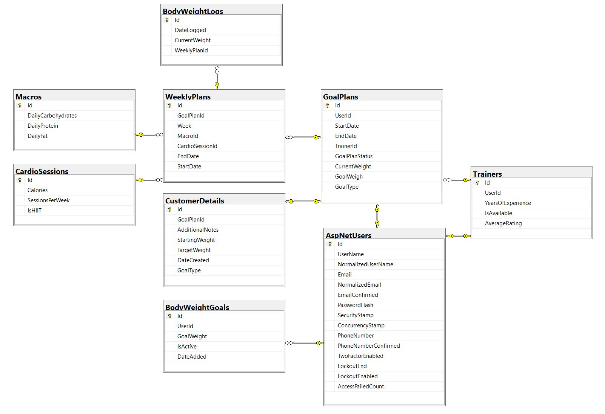

# **Fitness Tracker and Trainer Application**

Welcome to the **Fitness Tracker** application! This project is a small fitness management web application built using **ASP.NET Core MVC** and **Entity Framework Core**. It enables trainers and customers to manage fitness goals, weekly plans, and track progress effectively. It is ispired by another .NET fitness tracker project by [MattGardiner97](https://github.com/MattGardiner97/FitnessTracker) and the personal trainer [Matt Kido aka. Gokuflex](https://www.youtube.com/playlist?list=PLfdZhJK-QUpXjs-NKgExihgbaZv9LEY4j) with his online coaching client transformations. 

---

## **Features**

### For Customers:
- Log daily/weekly **body weight** and track progress.
- Receive **personalized weekly plans** from trainers.
- View assigned **macronutrient breakdown** and **cardio sessions**.
- Track overall **goal completion**.

### For Trainers:
- Manage **customers' goal plans** (approve/reject with reasons).
- Assign **weekly plans** including macros, cardio sessions, and progress tracking.
- View customer progress in a **dedicated dashboard**.
- Adjust plans dynamically based on progress.

---

## **Entity Relationship Diagram (ERD)**



The database schema includes the following key entities:
- **AspNetUsers**: Users of the system (Trainers and Customers).
- **GoalPlans**: Customer-specific fitness goals managed by trainers.
- **WeeklyPlans**: Weekly assignments for each goal plan.
- **BodyWeightLogs**: Tracks weight logs for each week.
- **Macros**: Macronutrient breakdown for weekly plans.
- **CardioSessions**: Cardio plan details.

---

## **Technologies Used**

- **Framework**: ASP.NET Core MVC
- **Database**: Microsoft SQL Server with Entity Framework Core
- **Authentication**: ASP.NET Core Identity
- **Front-End**: Bootstrap for UI components

---

## **Usage**
Change Connection String:
```json
"ConnectionStrings": {
    "DefaultConnection": "Your-Database-Connection-String"
}
```
Restore dependencies:
```bash
dotnet restore
```
Seed Users and Roles:
To seed default users (e.g., trainers and customers) and roles (e.g., Admin, Trainer, Customer):
```bash
dotnet ef database update
```
#### Trainer: Create, view, approve/reject customer goal plans.
#### Customer: Log body weight and track progress.
#### Admin: Manages Customer and Trainer (to be added)

#### Seeded accouts:
#### trainer@getfit.com
#### trainer2@getfit.com
##### customer@getfit.com

##### Password for all acounts:
##### 123
